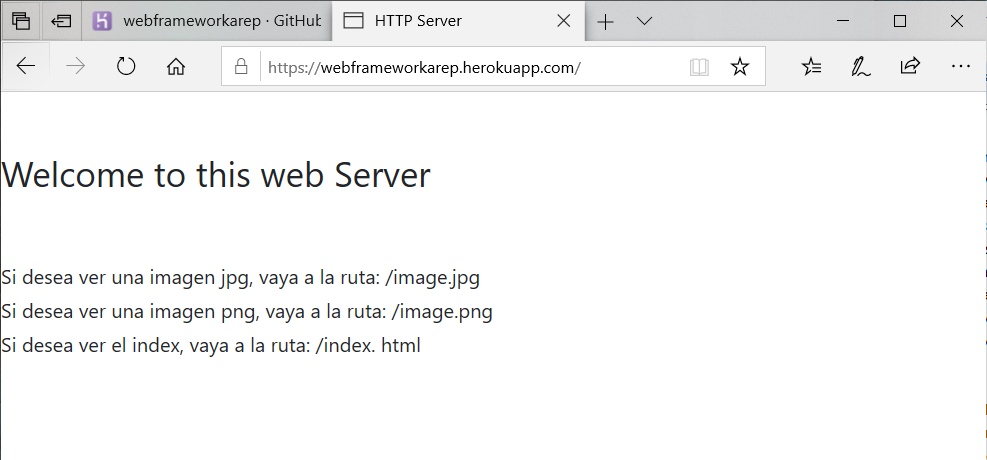
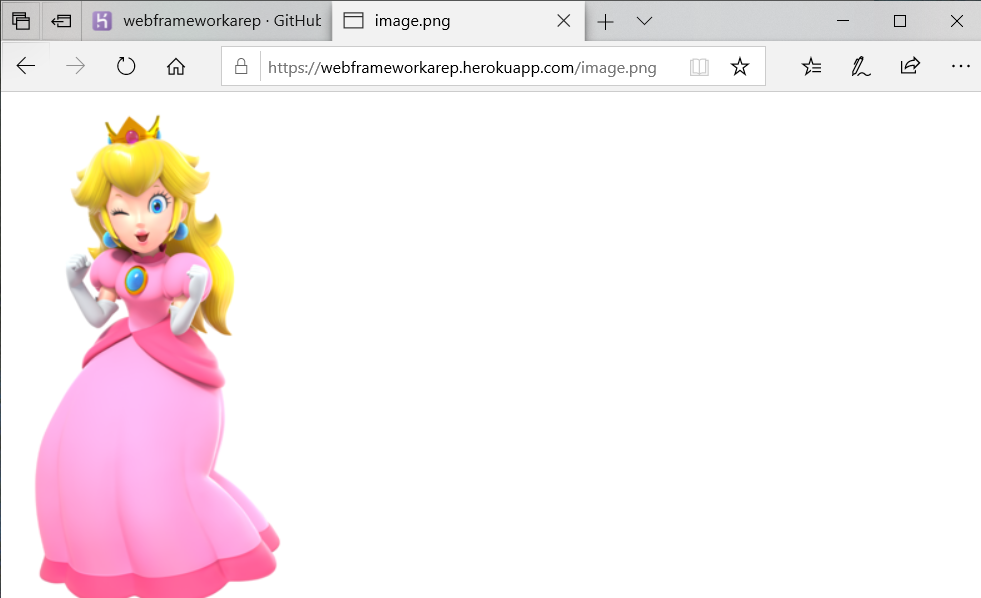
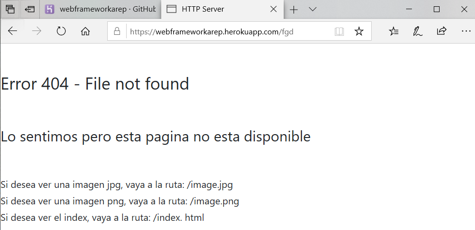
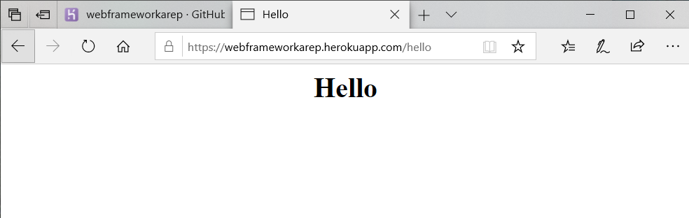

# Arep-WebFramework


This application implements a framework created with java that contains a web server that supports multiple consecutive requests and returns the requested files including html pages and images.The framework that allows a developer to create responds to requests through annotations about the methods created by the developer.

## Getting Started

 In order to use this project, first clone this repository or download the project.

Then access the address where the project is located and execute the following commands

```
mvn compile
mvn package
mvn install
```
In order to generate the documentation of the project use the command 

```
mvn javadoc:javadoc
```
This command will generate the documentation in the folder 
```
 /target/site/apidocs/
 ```
To run the project you can execute the command
```
mvn exec:java -D exec.mainClass"="edu.escuelaing.arep.Manager"
```
The application will be available in:

```
 http://localhost:4567/
```

To run the application in the heroku local web in windows, change the Profcile file to:

```
web: java -cp target\classes;target\dependency\* edu.escuelaing.arep.Manager
```
and execute the following command on your console:

```
heroku local web
```
The application will be available in:

```
 http://localhost:5000/
```


### Prerequisites

You will need maven java installed on your machine to employ this program

## Deployment

[Web server App heroku](https://webframeworkarep.herokuapp.com/) - heroku deploy

* main page


* static resources



* file not found


* dinamic result


## Built With

* [Maven](https://maven.apache.org/) - Dependency Management
* [Heroku](https://www.heroku.com/) - Deploy Enviroment
* [Java](https://www.java.com/es/download/) - Programming language


## Authors

* **Valentina Siabatto** - *Escuela Colombiana de Ingeniería Julio Garavito* 

See also the list of [contributors](https://github.com/Siabell/AREP-lab1-introduccion/graphs/contributors) who participated in this project.

## License

This project is licensed under the GNU General Public License v3.0 - see the [LICENSE.md](LICENSE.md) file for details


